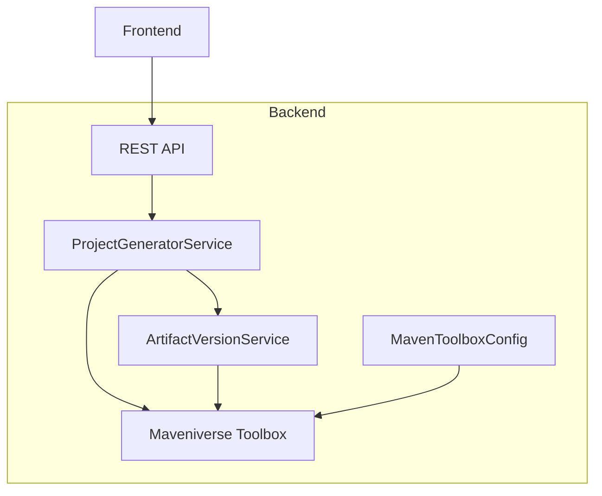
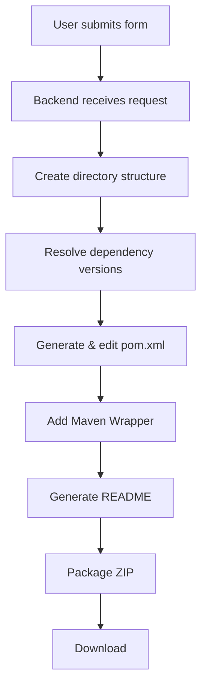
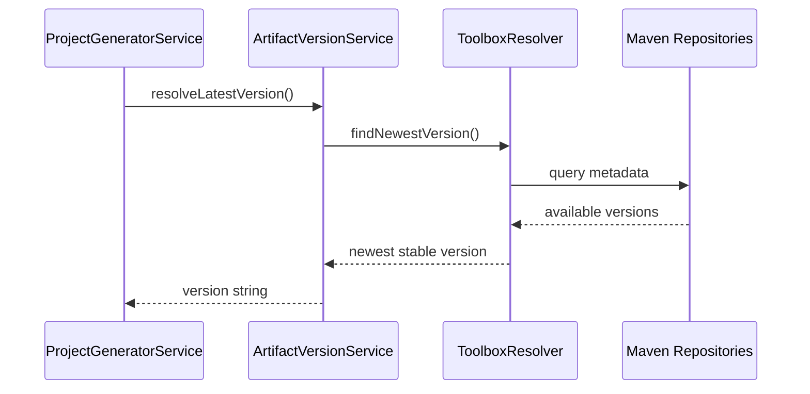
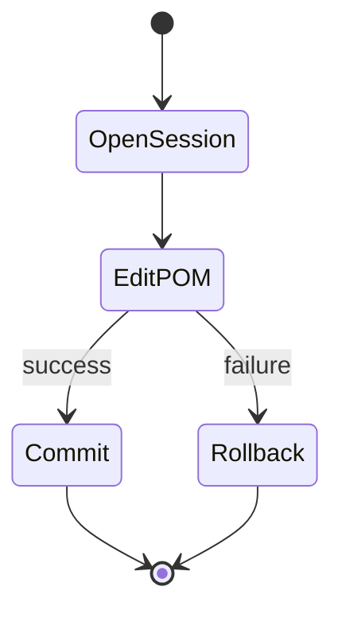

# Architecture Overview

This document describes the **high-level architecture** of Initializer for Apache Maven™: how the system is structured and the role of each main part. It does not go into implementation details; those are covered in the codebase and in blog posts (e.g. the toolbox integration).

## High-Level Structure

Initializer for Apache Maven™ follows a layered architecture with a clear separation between the **Frontend** and the **Backend**. The diagram below shows the Frontend at the top and all other components grouped inside the Backend.

## Architectural Layers

| Layer | Technology | Responsibility |
|-------|------------|----------------|
| **Frontend** | Next.js | Collects user input (project options, dependencies, plugins) and submits a project generation request. Provides the download of the generated project (ZIP). |
| **Backend** | Spring Boot + Maveniverse Toolbox | All components below run in the backend. |
| **REST API** | Spring Boot | Exposes the project generation endpoint, validates input, and returns the generated project or error information. |
| **ProjectGeneratorService** | Spring Boot | Orchestrates the generation flow: directory layout, POM generation, Maven Wrapper, README, and packaging. |
| **ArtifactVersionService** | Spring Boot | Resolves the latest (or requested) versions for dependencies and plugins from Maven repositories. |
| **MavenToolboxConfig** | Spring Boot | Configures the Maveniverse Toolbox context (e.g. settings, local repository) used by the backend. |
| **Maveniverse Toolbox** | Library | Handles all Maven-specific concerns: POM structure, dependency and plugin versions, and editing of the project file. |

## Main Components

- **Frontend (Next.js)**
  Single-page application that guides the user through project configuration and triggers generation. It is the only part that runs in the browser.

- **Backend**
  All of the following components run in the backend (Spring Boot application):

      - **ProjectController / REST API**
      Entry point of the backend. Receives the project request DTO and delegates to the project generation service.

      - **ProjectGeneratorService**
      Orchestrates the full generation pipeline: creates the directory structure, resolves versions, generates and edits the POM, adds Maven Wrapper and README, and builds the ZIP.

      - **ArtifactVersionService**
      Resolves the latest (or requested) versions for dependencies and plugins from Maven repositories.

      - **MavenToolboxConfig**
      Configures the Maveniverse Toolbox context (e.g. settings, local repository) used by the backend.

      - **Maveniverse Toolbox**
      Library used for programmatic POM creation and editing, and for version resolution. All Maven-specific logic is encapsulated here.

## End-to-End Generation Flow

The full lifecycle of a project request is:

## Version Resolution

The backend resolves dependency and plugin versions at generation time by querying Maven repositories, so generated projects use current stable versions instead of hard-coded ones.

## POM Editing: Transactional Session

POM changes are applied inside a single editing session. Either all changes are committed, or the session is rolled back so the POM stays valid.

## Summary

1. User configures the project in the frontend and submits the form.
2. The frontend sends a project request to the backend REST API.
3. The backend creates the project directory structure and a minimal POM.
4. Dependency and plugin versions are resolved (using Toolbox and Maven repositories).
5. The POM is completed inside a transactional edit session; other artifacts (Maven Wrapper, README) are generated.
6. The project is packaged as a ZIP and returned to the user.

For more detail on how the toolbox is used (DSL, plugin configuration, etc.), see the related blog post and the backend source code.
